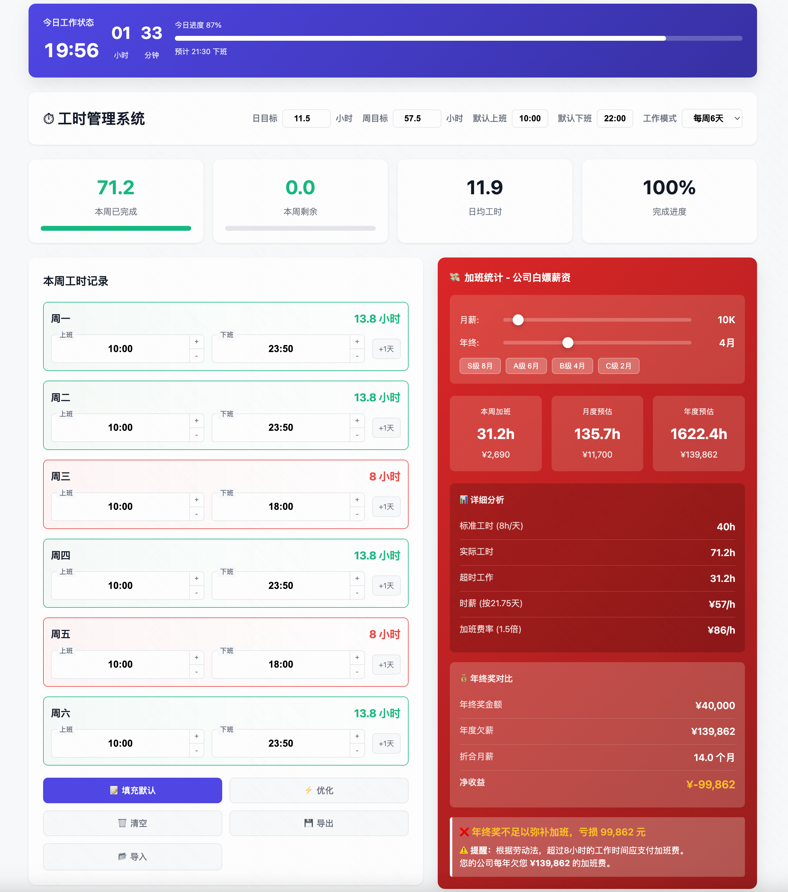

# ⏱️ 工时计算器 workTime
https://hanxu2018.github.io/workTime/


轻松记录与分析你的工作时间，助力高效管理和科学加班！


## 项目简介

**workTime** 是一款专为中国工作场景设计的工时计算和统计分析工具，支持灵活配置工作模式和目标，帮助用户合理安排每日和每周工时。它适合自由职业者、远程办公人士及团队成员，提升时间利用率与工作效率。

## 主要功能

- **今日工时状态**：展示当前时间、已工作小时、剩余小时与分钟、今日进度条及预计下班时间。
- **多维工时统计**：支持每日和每周目标配置，实时统计实际工时与目标达成情况。
- **智能配置**：
  - 日目标/周目标小时数自由设置
  - 上下班时间自定义
  - 多种工作模式（标准5天、大小周等）
- **可视化数据面板**：
  - 日/周工时统计卡片
  - 日历与图表展示
  - 进度条与倒计时
- **加班/薪资计算**：加班统计、薪资推算、滑动条调整等个性化分析。
- **工时清除与文件导入**：便捷清空单日工时，支持文件导入/导出。

## 技术栈

- **前端**：纯 HTML5 + CSS3 + JavaScript（无依赖，界面美观，响应式设计）
- **本地存储**：数据保存在本地，隐私安全

## 快速开始

1. 克隆仓库：
   ```bash
   git clone https://github.com/HANXU2018/workTime.git
   ```
2. 打开 `index.html` 文件即可使用，无需安装任何依赖！

## 项目亮点

- 🎨 现代化 UI 设计，支持移动端和桌面端
- ⚡ 极速本地运行，无需服务器
- 🧮 灵活工时计算，适应各种复杂工作制
- 📈 数据可视化，工作进度一目了然
- 🔒 数据本地化，保护你的隐私

## 贡献方式

欢迎提出 Issue 或 PR，您的建议能让项目更好用！

## 联系方式

- GitHub: [HANXU2018](https://github.com/HANXU2018)

---

> 让你的每一小时更有价值，从 workTime 开始！
